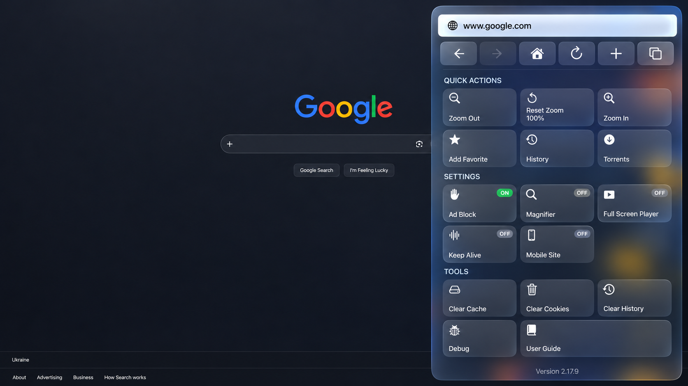
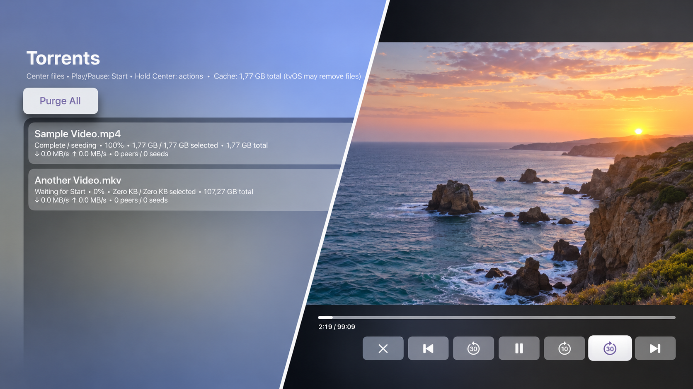

# tvOSofaBrowse

### The web from your sofa.

> **A Siri Remote with a touch surface or touch-enabled clickpad is required.** Button-only remotes cannot move the browser pointer.

> **Do not publish this app on the App Store.** It uses private tvOS and WebKit APIs. The source is provided as-is for personal development and sideloading, without warranty.



*Visual style tested on tvOS 27.*

**Point like a mouse.** Click supported custom video players inside iframes. Block ads, zoom to read, and reach your tabs and tools from one menu.



**Choose a torrent. Watch while it downloads.** The diagonal cut presents two separate app screens. Keep the app open for uninterrupted transfers; tvOS may suspend downloads in the background. [Details](docs/USER_GUIDE.md#background-downloads).


**One touchpad. Everywhere.** This guide opens from **Menu → Tools → User Guide**. [Read the full User Guide](docs/USER_GUIDE.md).

<details>
<summary>Install on your Apple TV</summary>

### 1. Prepare your Mac

Install Xcode with the tvOS SDK and open it once to finish setup. Sign in under **Xcode → Settings → Apple Accounts**; a personal Apple Account can be used for local development. The dependency scripts need `curl`, `unzip`, `tar`, `shasum` and `python3`; no Homebrew package is required by this repository.

Pair the Apple TV before building:

1. Connect the Mac and Apple TV to the same local network with IPv6 enabled.
2. On Apple TV, open **Settings → Remotes and Devices → Remote App and Devices**.
3. In Xcode, open **Device Hub** from **Xcode → Open Developer Tool → Device Hub** (or **Manage Devices** from the destination menu). Choose **+ → Pair Nearby Device → Apple TV**, select your TV and enter the PIN shown on it.
4. Wait until the TV appears as an available run destination. See [Apple's device-pairing instructions](https://developer.apple.com/documentation/xcode/pairing-your-devices-with-your-mac) if pairing does not complete.

Clone the source:

```sh
git clone https://github.com/just-better-code/tvOSofaBrowse.git
cd tvOSofaBrowse
```

### 2. Install media dependencies

From the repository root, run:

```sh
./scripts/bootstrap-torrent-deps.sh
./scripts/bootstrap-vlc-deps.sh
```

The scripts download pinned libtorrent, Boost and TVVLCKit versions, check archive SHA-256 hashes, and place the binaries in the ignored `.deps/` directory. Run them before building the Xcode project. They can be rerun if a dependency is missing; an existing complete installation is skipped.

### 3. Set up local signing

Create your ignored local signing file:

```sh
cp _Project/Browser/Config/Signing.local.xcconfig.example _Project/Browser/Config/Signing.local.xcconfig
```

Edit only that local file: replace `YOUR_TEAM_ID` with the team ID selected in Xcode, and replace `org.example.your.tvosbrowser` with your own unique bundle identifier. Do not put personal signing values in shared project files.

### 4. Build, install and launch

1. Open [`_Project/Browser.xcodeproj`](_Project/Browser.xcodeproj) in Xcode.
2. Select the shared **Browser** scheme and your paired Apple TV as the destination.
3. Press **Run** (`⌘R`). Xcode builds, signs, installs and launches the app. Use a touchpad-equipped remote to control it.

If Xcode reports a missing libtorrent or TVVLCKit binary, rerun both bootstrap scripts and confirm `.deps/` contains their `.xcframework` directories. If signing fails, check the team and bundle identifier in `Signing.local.xcconfig` and Xcode's automatic signing status. The app is intended for local sideloading; there is no App Store or prebuilt release.

</details>

<details>
<summary>Compatibility and project notes</summary>

Website players, formats, codecs and DRM vary; some iframe controls and fullscreen paths still need work. This personal-use fork of [tvOS Browser](https://github.com/jvanakker/tvOSBrowser) uses private tvOS and WebKit APIs and has no App Store or prebuilt release. Preserve dependency licenses when redistributing source or binaries.

Current source version: **2.17.11**. The retrospective version history has no matching published release or Git tag.

</details>

*Images are illustrative and based on anonymized app screenshots.*
