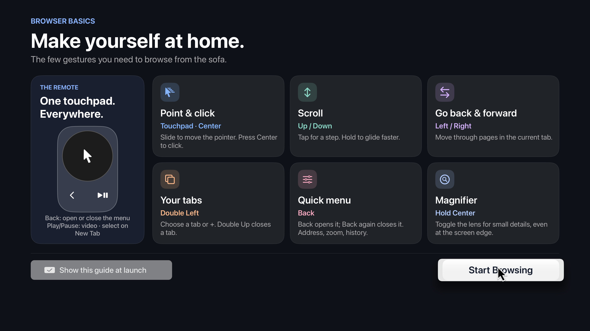
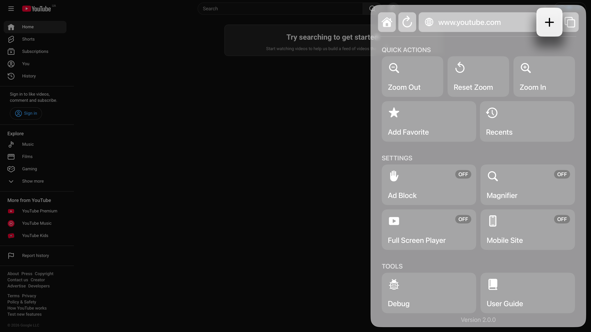

# tvOS Browser

**Compared with the [upstream project](https://github.com/jvanakker/tvOSBrowser), this fork adds a redesigned Siri Remote interface, a tiled browser menu, a New Tab page with Favorites and recent visits, custom iframe video player controls, persistent tab navigation, and automatic local history recovery.**

[Read the upstream project’s README](https://github.com/jvanakker/tvOSBrowser/blob/master/README.mdown).

A web browser for Apple TV, built with `WKWebView` and designed for the Siri Remote. There is no prebuilt binary; build and sign the app with Xcode for your own device.

> This project uses private tvOS and WebKit APIs and is intended for personal development and sideloading. App Store distribution is not supported.

## Changelog

See [CHANGELOG.md](CHANGELOG.md) for versioned changes in the [Common Changelog](https://common-changelog.org/) format. Current version: **2.15.22**.

Detailed development history, decisions, and verification notes: [DEVELOPMENT_HISTORY.md](DEVELOPMENT_HISTORY.md). Planned features and rejected directions: [ROADMAP.md](ROADMAP.md).

## Build

Open [`_Project/Browser.xcodeproj`](_Project/Browser.xcodeproj) in Xcode, select the `Browser` scheme, then build for an Apple TV Simulator or a paired Apple TV. Keep the project’s existing signing settings for device builds.

## User guide

Read the detailed [User Guide](USER_GUIDE.md) for remote controls, tabs, history, video, local recovery, and diagnostic logging. Open the quick guide in the app from **Menu → Tools → User Guide**.

The screenshots below show the interface; the written guide describes the current controls.

## Features and limits

- Multiple tabs with session restoration
- Local Favorites and browsing history
- Pointer navigation, smooth scrolling, and a cursor magnifier
- Content blocking and page zoom
- Custom iframe player interaction, including players inside Shadow DOM
- In-page theater/fullscreen with remote playback controls
- Full-screen video playback through tvOS WebKit and AVPlayer
- Automatic local backup and recovery of history, Favorites, and tab navigation

Video playback depends on the source format, codecs, delivery method, DRM, and the website’s player. Full-screen mode cannot make an unsupported stream playable.
